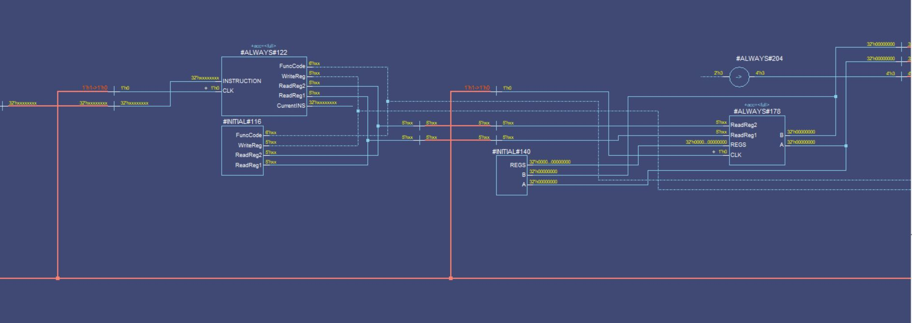

# MIPS-ALU-V2

### DESCRIPTION
MIPS ALU with PC (Program Counter) , Instruction memory and Data Memory. It can perform ADD,SUB,AND,OR,NOR,SLT(Set on Less Than) operations. 

Following figure shows that part of the DataFlow Diagrem of the Design and run it with your ModelSim PE 
 

